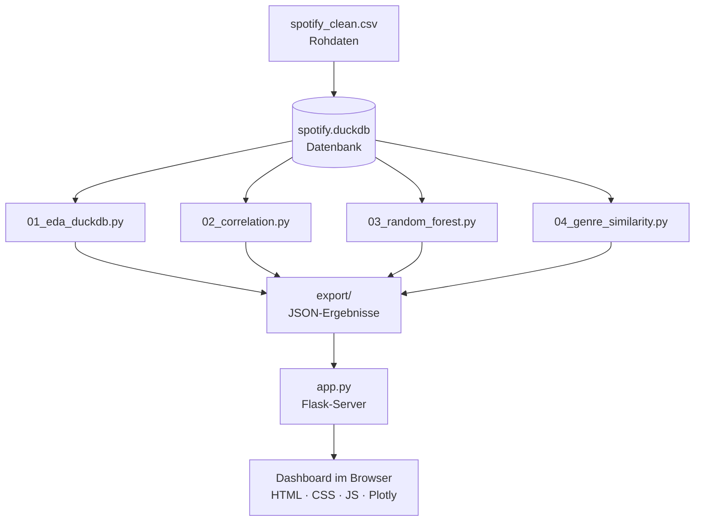

# Spotify Analytics Dashboard

Ein interaktives Dashboard zur Analyse von Spotify-Songs: Popularität, Audio-Features, Genre-Ähnlichkeit und Track-Exploration. Die Analyse erfolgt in Python, die Darstellung über ein Flask-Dashboard mit interaktiven Plotly-Visualisierungen.

---

## Überblick

Das Projekt untersucht einen Datensatz von rund 114.000 Spotify-Songs über 115 Genres und beantwortet Fragen wie:

- Welche Eigenschaften haben populäre Songs?
- Welche Features erklären Popularität wirklich?
- Welche Genres klingen ähnlich?
- Wie unterscheidet sich ein einzelner Song von seinem Genre?

---

## Architektur-Prinzip

Das zentrale Prinzip ist die **Trennung von Analyse und Darstellung**:
Die schwere Berechnung (Statistik, Machine Learning, Aggregationen) läuft einmalig in Python und speichert die Ergebnisse als JSON. Das Dashboard lädt nur diese fertigen Ergebnisse – dadurch bleibt es schnell und muss keine Berechnungen im Browser durchführen.



---

## Verwendete Technologien

**Analyse (Python)**
- **Pandas** – Datenaufbereitung und Feature-Berechnung
- **DuckDB** – SQL-Datenbank für Abfragen und Aggregationen
- **scikit-learn** – Random Forest, PCA, KMeans, Standardisierung, Permutation Importance
- **Plotly** – Erzeugung der Genre-Map als eingebettete Grafik

**Dashboard**
- **Flask** – lokaler Webserver, der die JSON-Ergebnisse ausliefert
- **HTML / CSS / JavaScript** – Aufbau, Design (Spotify-Look) und Interaktivität
- **Plotly.js** – interaktive Diagramme (Charts, Heatmaps, Radar, Scatter)

---

## 📁 Projektstruktur
```
New folder/
├── spotify_clean.csv          # bereinigter Datensatz
├── spotify.duckdb             # DuckDB-Datenbank
│
├── 01_eda_duckdb.py           # Datenbank & deskriptive Analysen
├── 02_correlation.py          # Korrelationsmatrix & Korrelationen
├── 03_random_forest.py        # Random-Forest-Modell + Cross-Validation
├── 04_genre_similarity.py     # Genre-Ähnlichkeit, PCA + KMeans
│
├── export/                    # von den Skripten erzeugte JSON-Ergebnisse
│
└── dashboard/
    ├── app.py                 # Flask-Server (liest aus ../export)
    ├── static/                # app.js, style.css, plotly.min.js
    └── templates/             # index.html
```

---

## Die vier Dashboard-Seiten

| Seite | Inhalt |
|-------|--------|
| **Überblick** | Kennzahlen des Datensatzes, Top 10 Songs, populärste Genres |
| **Popularität** | Feature-Vergleich populär vs. Rest, Korrelationen, Random Forest mit Feature Importance |
| **Genres** | Audio-Profil je Genre, Feature-Übersicht, Genre-Map (PCA + KMeans), Klang-Gruppen |
| **Track-Explorer** | Einzelnen Song wählen: Merkmale, Rang im Genre, Vergleich zum Genre-Durchschnitt |

---

## Methodische Prinzipien

Das Projekt legt Wert auf saubere, nachvollziehbare Methodik:

- **Deduplizierung** – Songs, die in mehreren Genres gelistet sind, zählen bei Song-Analysen nur einmal, um Verzerrungen zu vermeiden.
- **Vermeidung von Data Leakage** – im Random Forest wird verhindert, dass identische Songs gleichzeitig in Trainings- und Testdaten landen (sonst künstlich zu hohes R²).
- **Permutation Importance** – robuster als die Standard-Feature-Importance, die bei korrelierten Features verzerrt.
- **Cross-Validation** – prüft, ob die Modell-Ergebnisse stabil und representativ sind.
- **PCA + KMeans** – reduziert die Audio-Features auf zwei Dimensionen und gruppiert Genres automatisch in Klang-Familien.
